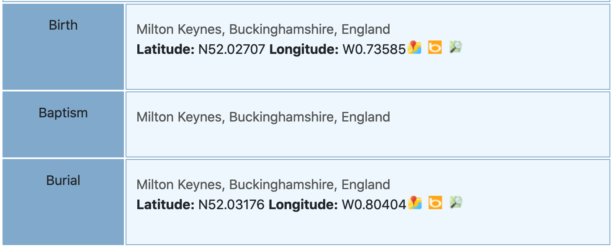
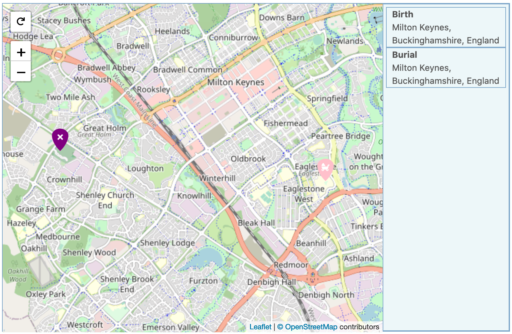
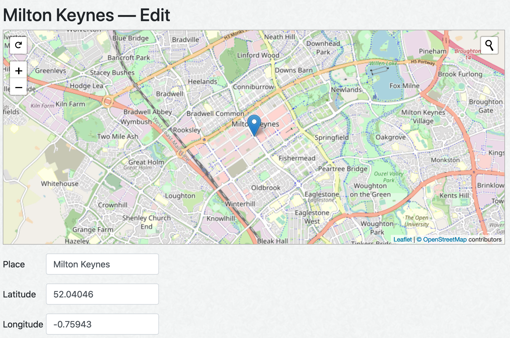
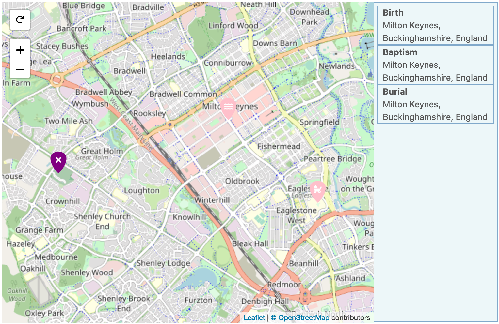

webtrees uses the GEDCOM data format to store your genealogy data.

GEDCOM allows you to store the co-ordinates (latitude/longitude) of
**events**, but not of **places**.

So, it can store the location of a specific birth, marriage or burial -
but it cannot store the location of "London, England".

Consider an individual with three events, all in the same town:  
For the birth, we have the co-ordinates of the hospital.  
For the burial, we have the co-ordinates of the cemetery.  
For the baptism, we have no-coordinates.

```
0 @X1@ INDI
1 NAME John /Doe/
1 BIRT
2 PLAC Milton Keynes, Buckinghamshire, England
3 MAP
4 LONG W0.73585
4 LATI N52.02707
1 BAPM
2 PLAC Milton Keynes, Buckinghamshire, England
1 BURI
2 PLAC Milton Keynes, Buckinghamshire, England
3 MAP
4 LONG W0.80404
4 LATI N52.03176
```



webtrees can show the locations of the birth and burial on a map, but it
does not have the co-ordinates of the baptism.



So, we need some co-ordinates that represent the entire town (e.g. the town centre)
that we can use for any events in the town that do not have their own co-ordinates.

webtrees allows you to store co-ordinates for places (as opposed to events) in
a "gazetteer".  From the control panel, there is a link “Geographic data”.

This gazetteer exists independely from your genealogy data, and is shared
with all the family trees on your site.

Here, you would store the co-ordinates for places.  You could add some
co-ordinates  for "England, Buckinghamshire, Milton Keynes"



Now, webtrees will show the baptism on a map - at the town centre.



